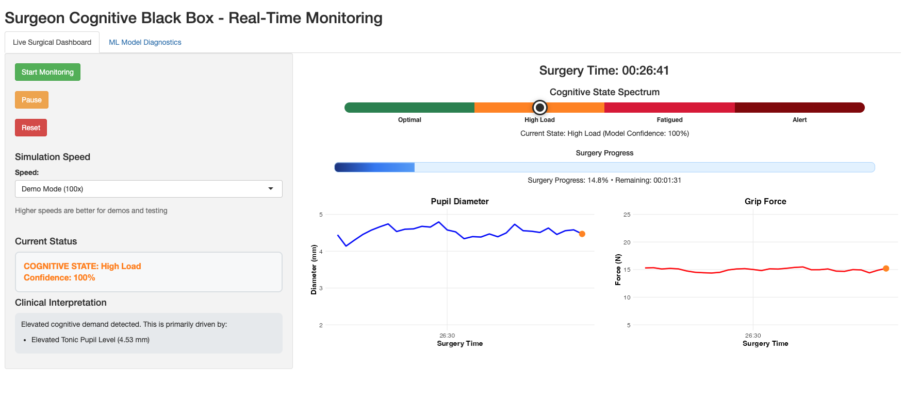

# The Surgeon's "Cognitive Black Box" 🧠

[](https://opensource.org/licenses/MIT)
[](https://github.com/mohdasti/surgical-cognitive-dashboard)
[](https://www.r-project.org/)
[](https://shiny.rstudio.com/)

A proof-of-concept dashboard for monitoring a surgeon's cognitive state in real-time using machine learning on simulated physiological and motor data.

**➡️ [View the Full, Interactive Case Study on My Portfolio](https://mdastgheib.com/projects/cognitive-black-box.html)** *(<-- Update this link when your Quarto page is live)*

---

## 🚀 The Vision

Inspired by my work at **Surgical Safety Technologies (SST)** and grounded in my PhD research on the cognitive neuroscience of effort, this project addresses a critical challenge in patient safety: how can we proactively monitor a surgeon's cognitive state to mitigate the risks of fatigue and overload?

This R Shiny application simulates a "Cognitive Black Box"—a real-time analytics platform that translates complex data streams into simple, actionable insights.



---

## ✨ Key Features

* **Real-Time Simulation:** The dashboard simulates a live, second-by-second data stream from a multi-hour surgical procedure.
* **Multimodal Data Fusion:** Ingests and processes multiple data types simultaneously:
    * **Physiological:** Pupillometry data as a biomarker for neural gain and cognitive load.
    * **Motor Control:** A novel "grip force variability" metric, hypothesized to be a proxy for attentional lapses.
* **Machine Learning Core:** Uses a trained **XGBoost** model to classify the surgeon's cognitive state into one of four categories: *Optimal*, *High Load*, *Fatigued*, or *Attentional Lapse*.
* **Explainable AI (XAI):** Includes a "Why" panel powered by **SHAP** values that explains in plain language which data signals are driving the current prediction, ensuring the model is interpretable and trustworthy.

---

## 🛠️ Tech Stack

* **Language:** R
* **Core Packages:** `shiny`, `dplyr`, `xgboost`, `ggplot2`, `zoo` (for rolling calculations)
* **Development Environment:** RStudio / Cursor

---

## 📂 Project Structure

The repository is organized into four main directories:

/ (project root)
├── data/
│   ├── raw/
│   └── processed/
│
├── scripts/
│   ├── 01_simulate_data.R
│   ├── 02_feature_engineering.R
│   └── 03_train_model.R
│
├── shiny_app/
│   └── app.R
│
└── case_study/
    ├── cognitive_black_box.qmd
    └── images/


---

## 🏁 Getting Started

To run this application locally:

1.  **Clone the repository:**
    ```bash
    git clone [https://github.com/mohdasti/surgical-cognitive-dashboard.git](https://github.com/mohdasti/surgical-cognitive-dashboard.git)
    cd surgical-cognitive-dashboard
    ```

2.  **Install dependencies:**
    This project uses `renv` for package management. Open the `.Rproj` file in RStudio and run the following command in the console to restore the project library:
    ```r
    renv::restore()
    ```

3.  **Run the Pipeline (Optional):**
    If you want to re-generate the data and re-train the model, run the scripts in the `/scripts` directory in numerical order.
    ```r
    source("scripts/01_simulate_data.R")
    source("scripts/02_feature_engineering.R")
    source("scripts/03_train_model.R")
    ```

4.  **Launch the Shiny App:**
    ```r
    shiny::runApp("shiny_app/app.R")
    ```
