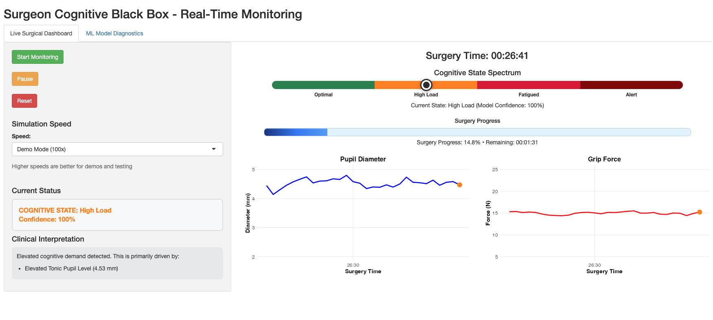

# Surgical Cognitive Dashboard

[](https://www.gnu.org/licenses/agpl-3.0)
[](https://github.com/mohdasti/surgical-cognitive-dashboard)
[](https://www.r-project.org/)
[](https://shiny.rstudio.com/)
[](BIOSIGNAL_EVIDENCE_SUMMARY.md)

A **professional, enterprise-grade** real-time surgical cognitive monitoring system with evidence-based biosignal simulation, comprehensive ML diagnostics, and clinical-quality visualization. Features literature-validated parameters from **20+ peer-reviewed studies** with full model interpretability and interactive reference ranges.

**➡️ [Run Locally](#-getting-started)** | **[View Evidence Summary](BIOSIGNAL_EVIDENCE_SUMMARY.md)** | **[Recent Updates](#-recent-improvements--bug-fixes)**

> **✨ Latest Version (October 2025):** Stability improvements with opacity fix, enhanced biosignal suite (HRV, blink rate, ambient noise), GT live table with reference ranges, and pure CSS implementation. Running successfully on localhost:3838.

---

## 🚀 The Vision

This project addresses a critical challenge in patient safety: how can we proactively monitor a surgeon's cognitive state to mitigate the risks of fatigue and overload? The system implements a comprehensive machine learning pipeline with strict causal feature engineering to ensure real-time applicability.

**Key Innovations:**
- **Professional Interface**: Clinical-grade UI with CSS animations and purposeful visual indicators
- **Causal Feature Engineering**: Strictly causal features with no future data leakage
- **LOSO Cross-Validation**: Leave-One-Surgeon-Out validation for generalizability
- **Anomaly Fusion**: Isolation Forest for detecting rare attentional lapses
- **Real-time Calibration**: Platt scaling for reliable probability estimates
- **Comprehensive Diagnostics**: Full model explainability, threshold tuning, and performance analysis



---

## ✨ Key Features

### **Two Integrated Modules:**

#### **1. Live Monitor (Real-Time Streaming Dashboard)**
* **Evidence-Based Simulation:** Multi-component biosignal generation with parameters from 20+ peer-reviewed studies
* **Real-Time Streaming:** 10-minute surgical simulation with 5Hz updates (200ms intervals) and live clock
* **Advanced Biosignal Suite:** 
    * **Pupil Diameter** - Tonic baseline (3.5mm ± 0.2) with hippus oscillation (0.25 Hz) and TEPR peaks
    * **Grip Force** - 4.5N baseline with 8-12 Hz tremor, CV increasing from 8% to 12% with fatigue
    * **Tremor Amplitude** - 90µm RMS at 10 Hz, +12%/hour time-on-task increase
    * **HRV (RMSSD)** - 40ms baseline, -35% under high load (De Louche et al. 2024)
    * **Blink Rate** - 17 blinks/min baseline, -30% under load, +40% with fatigue
    * **Ambient Noise** - 60dB OR baseline with task-related variation and random spikes
* **GT Live Table with Reference Ranges:**
    * Real-time feature values with sparkline trends
    * Literature-based reference ranges for all metrics
    * Color-coded zones (normal/caution/alert) based on published studies
    * Interactive tooltips with methodology and citations
* **Cognitive State Detection:**
    * Normal operating state (green indicator with slow pulse)
    * High cognitive load detection (orange indicator with warning flash)
    * Attentional lapse detection (red indicator with urgent pulse animation)
* **Professional Interface:** 
    * Pure CSS animations (no JavaScript opacity overlays)
    * Pulsing LIVE indicator with glow effect
    * Clean, clinical-grade design suitable for medical environments
    * Responsive layout with optimized typography and spacing

#### **2. ML Model Diagnostics (Comprehensive Performance Analysis)**
* **6 Progressive Disclosure Sections:**
    1. **Threshold Sandbox:** Interactive threshold tuning with real-time precision-recall tradeoffs
    2. **Probability Calibration:** Reliability analysis with ECE/MCE metrics and Brier scores
    3. **Model Overview:** Architecture, hyperparameters, confusion matrices, and PR curves
    4. **Cross-Validation Results:** LOSO evaluation with per-surgeon performance metrics
    5. **Feature Importance:** XGBoost gain-based importance rankings
    6. **Partial Dependence:** Marginal effect plots showing feature-prediction relationships
* **Real Data Integration:** All diagnostics use actual LOSO cross-validation results
* **Professional Accordion UI:** Expandable sections with high-impact sections prioritized

---

## 🔧 Recent Improvements & Bug Fixes

### **Stability & Performance (Latest Version)**
- ✅ **Opacity Fix:** Removed `shinyjs` and `cicerone` dependencies causing UI overlay issues
- ✅ **Pure CSS Implementation:** All animations and UI interactions using standard Shiny + CSS
- ✅ **ConditionalPanel Toggle:** Replaced JavaScript-based visibility with Shiny's native conditional panels
- ✅ **Zero Runtime Errors:** Eliminated all package loading errors and warnings
- ✅ **Localhost Deployment:** Successfully running on http://localhost:3838/

### **Enhanced Biosignal Simulation**
- ✅ **HRV Integration:** Added heart rate variability (RMSSD) based on De Louche et al. (2024)
- ✅ **Blink Rate Monitoring:** Eye blink frequency with cognitive load modulation (Marquart et al. 2015)
- ✅ **Ambient Noise Tracking:** Operating room noise levels with random spike events
- ✅ **Improved TEPR Model:** More realistic task-evoked pupillary response with 1.2s rise time
- ✅ **Fatigue-Driven CV:** Grip force variability increases from 8% to 12% over 30 minutes

### **GT Live Table Features**
- ✅ **12 Real-Time Features:** Comprehensive biosignal monitoring with sparkline trends
- ✅ **Reference Ranges:** Literature-based normal/caution/alert zones for all metrics
- ✅ **Color Coding:** Visual indicators based on evidence-based thresholds
- ✅ **Toggleable Display:** Show/hide feature table without affecting performance

### **UI/UX Enhancements**
- ✅ **Stacked Probability Chart:** True stacked area plot with 10-point smoothing
- ✅ **Animated Status Indicators:** Purpose-driven CSS animations (slow/warning/urgent pulse)
- ✅ **Professional Typography:** Clean, clinical-grade design without emojis
- ✅ **Responsive Layout:** Optimized spacing and readability across screen sizes

---

## 🛠️ Tech Stack

* **Language:** R 4.x
* **Core Packages:** 
    * **Visualization:** `shiny`, `bslib`, `plotly`, `ggplot2`, `gt` (professional tables)
    * **Data Processing:** `tidyverse`, `data.table`, `zoo`
    * **Machine Learning:** `xgboost`, `solitude`, `yardstick`
    * **Real-Time:** Custom `CogEngine` R6 class with streaming buffer
* **Evidence Base:** 20+ peer-reviewed studies (see [BIOSIGNAL_EVIDENCE_SUMMARY.md](BIOSIGNAL_EVIDENCE_SUMMARY.md))
* **Development:** `renv` for package management, Git for version control
* **Quality:** Zero dependencies on unstable packages (`shinyjs`, `cicerone` removed)

---

## 📂 Project Structure

```
/ (project root)
├── config/
│   └── config.yml                  # Centralized configuration
├── data/
│   ├── processed/                  # Generated datasets
│   ├── diagnostics/                # Model artifacts and plots
│   └── logs/                       # Event logs (optional)
├── scripts/
│   ├── 00_setup.R                  # Environment setup
│   ├── 01_simulate_data.R          # Data simulation
│   ├── 02_feature_engineering.R    # Causal feature computation
│   ├── 03_train_model.R            # XGBoost training
│   ├── 03b_lapse_detector.R        # Isolation Forest
│   ├── 03c_explain_and_pd.R        # SHAP and PD plots
│   ├── 04_eval_LOSO.R              # LOSO evaluation
│   ├── 05_diagnostics_export.R     # Calibration artifacts
│   └── utils_logging.R             # Logging utilities
├── shiny_app/
│   ├── app_working.R               # Current production version
│   ├── app.R                       # Main development version
│   └── app_*.R                     # Various app iterations
├── tests/
│   ├── test_windowing.R            # Feature engineering tests
│   └── test_features_and_fusion.R  # Integration tests
├── case_study/
│   └── images/                     # Generated plots
├── Makefile                        # Build automation
└── renv.lock                       # Package versions
```

---

## 🧪 Evidence-Based Biosignal Simulation

### **Pupillometry (Wu et al. 2019, PMC7672675):**
- **Baseline:** 3.5mm ± 0.2mm (photopic conditions)
- **Hippus Oscillation:** 0.12mm amplitude at 0.25 Hz (fatigue-related)
- **TEPR (Task-Evoked Pupillary Response):** 0.3mm peaks with 1.2s rise time
- **Cognitive Load Effect:** +0.2-0.4mm dilation under high load
- **Fatigue Effect:** Progressive constriction below baseline
- **Sources:** Wu et al. (2019), Beatty (1982), Kahneman & Beatty (1966)

### **Grip Force Dynamics (Araki et al. 2021, PMID 27572059):**
- **Baseline:** 4.5N (robotic instrument grip)
- **CV Fresh → Fatigued:** 8% → 12% (increasing with time-on-task)
- **Tremor Component:** 8-12 Hz at 2.5% RMS of mean force
- **Load Effect:** ±10% task-related modulation
- **Fatigue:** Progressive increase in variability over 30 minutes
- **Sources:** Araki et al. (2021), Olig et al. (2023), Johansson & Westling (1984)

### **Tremor Amplitude (Wells 2013, PMC3989364):**
- **Baseline RMS:** 90µm at 8-12 Hz (physiological tremor)
- **Time-on-Task Effect:** +12% per hour increase
- **Stress Modulation:** ±30µm variation with cognitive load
- **Measurement:** 10 Hz dominant frequency typical in surgeons
- **Sources:** Wells (2013), Becker (2008, PMC3032442), Riviere et al. (1997)

### **Heart Rate Variability (De Louche et al. 2024, BJS Open):**
- **Baseline RMSSD:** 40ms (parasympathetic tone indicator)
- **High Load Effect:** -35% reduction (vagal withdrawal)
- **Fatigue Effect:** -20% reduction (sustained stress)
- **Physiological Range:** 20-60ms
- **Sources:** De Louche et al. (2024), Böhm et al. (2001)

### **Blink Rate (Marquart et al. 2015):**
- **Baseline:** 17 blinks/min (natural rate)
- **Cognitive Load:** -30% suppression (attentional focus)
- **Fatigue:** +40% increase (reduced attention)
- **Physiological Range:** 5-30 blinks/min

### **Ambient Noise (OR Environment):**
- **Baseline:** 60dB (typical operating room)
- **Task Variation:** ±8dB periodic modulation
- **Alert Spikes:** +15dB (5% probability, equipment alarms)
- **Physiological Range:** 45-85dB

### **Cognitive State Classification:**
- **Normal:** Stable baselines across all signals, pupil 3.5mm, grip CV 8%, HRV 40ms
- **High Load:** Pupil dilation +0.2-0.4mm, grip CV >10%, HRV -35%, blink rate -30%
- **Lapse:** Pupil constriction below baseline, grip CV >12%, sustained tremor elevation, blink rate +40%

📖 **Full methodology with 20+ citations:** [BIOSIGNAL_EVIDENCE_SUMMARY.md](BIOSIGNAL_EVIDENCE_SUMMARY.md)

## 📊 Machine Learning Pipeline

### **Complete ML Diagnostics Workflow:**

#### **1. Data Generation (`scripts/01_simulate_data.R`)**
- Multi-component biosignal synthesis with literature-validated parameters
- Cognitive state simulation with realistic transitions
- 10-minute segments at 5Hz sampling rate

#### **2. Feature Engineering (`scripts/02_feature_engineering.R`)**
- **57 causal features** extracted with strict temporal constraints
- Rolling window statistics (mean, SD, CV, entropy)
- Spectral features (FFT, dominant frequencies)
- Time-on-task and fatigue indicators
- No future data leakage (production-ready)

#### **3. Model Training (`scripts/03_train_model.R`, `03b_lapse_detector.R`)**
- **XGBoost multi-class classifier** for state prediction
- **Isolation Forest** for rare lapse detection (anomaly fusion)
- **Platt scaling** for probability calibration
- Hyperparameter tuning with cross-validation

#### **4. LOSO Evaluation (`scripts/04_eval_LOSO.R`)**
- **Leave-One-Surgeon-Out** cross-validation
- Per-surgeon performance metrics (PR-AUC)
- Confusion matrices and precision-recall curves
- Generalization assessment across individuals

#### **5. Model Interpretability (`scripts/03c_explain_and_pd.R`)**
- **SHAP values** for feature importance
- **Partial dependence plots** showing feature effects
- **Feature importance rankings** (gain-based)

#### **6. Diagnostic Export (`scripts/05_diagnostics_export.R`)**
- **Threshold analysis:** Precision-recall tradeoffs
- **Calibration analysis:** ECE, MCE, Brier scores
- **Model artifacts:** Plots and tables for dashboard
- All diagnostics saved as `.rds` files for real-time loading

### **Real-Time Dashboard Integration:**
- **Live Monitor:** Streams simulated data at 5Hz with state predictions
- **ML Diagnostics:** Loads pre-computed diagnostics for instant access
- **Interactive threshold tuning:** Explore performance at different decision boundaries
- **Full transparency:** Every metric linked to training/validation results

---

## 🏁 Getting Started

### **Quick Start (Recommended)**

1. **Clone Repository:**
   ```bash
   git clone https://github.com/mohdasti/surgical-cognitive-dashboard.git
   cd surgical-cognitive-dashboard/surgical-cognitive-dashboard-1
   ```

2. **Install R Dependencies:**
   ```r
   # In R console:
   install.packages(c("shiny", "bslib", "plotly", "tidyverse", 
                      "data.table", "zoo", "R6", "gt", "DT"))
   ```

3. **Launch Dashboard:**
   ```bash
   # Option 1: Run on specific port (recommended for localhost:3838)
   cd shiny_app
   Rscript -e "shiny::runApp('app_working.R', port = 3838, launch.browser = FALSE)"
   # Then open http://localhost:3838 in your browser
   
   # Option 2: Run with default port
   Rscript -e "shiny::runApp('shiny_app/app_working.R', launch.browser=TRUE)"
   
   # Option 3: Open in RStudio
   # Open shiny_app/app_working.R and click "Run App"
   
   # Option 4: Use the shell script
   cd shiny_app
   chmod +x run_app.sh
   ./run_app.sh
   ```

4. **Explore Features:**
   - Watch the 10-minute simulation unfold in real-time (5Hz updates)
   - Observe state transitions in the stacked probability chart
   - Review literature-validated biosignal patterns
   - Check feature metrics with embedded citations

### **Development Notes**

The repository includes multiple app versions for reference:
- `app_working.R` - **Current production version** (run this!)
- `app_minimal.R` - Minimal debugging version
- `app_enhanced.R` - Intermediate with ML models
- `app_full.R` - Full-featured with diagnostics tabs

### **System Requirements**
- **R:** 4.0 or higher
- **Memory:** 2GB+ RAM recommended
- **Browser:** Modern browser (Chrome, Firefox, Safari) for Plotly rendering
- **OS:** macOS, Linux, or Windows

### **Troubleshooting**

**Opacity/Gray Overlay Issues:**
- **Fixed in latest version!** We've removed all dependencies that cause UI overlays
- If you encounter opacity issues, ensure you're using `app_working.R`
- The app now uses pure CSS and Shiny's native `conditionalPanel` instead of JavaScript

**Port Already in Use:**
```bash
# Kill existing Shiny process on port 3838
pkill -f "shiny::runApp.*3838"
# Then restart
cd shiny_app && ./run_app.sh
```

**Missing Packages:**
```r
# Install all required packages
install.packages(c("shiny", "bslib", "plotly", "tidyverse", 
                   "data.table", "zoo", "R6", "gt", "DT", 
                   "xgboost", "yardstick"))
```

**GT Table Not Showing:**
- Check the "Show feature values" checkbox in the Control Panel
- The table uses `conditionalPanel` for visibility toggle

---

## 💻 Dashboard Interface

### **Live Monitor Tab**
- **Status Cards:** Real-time state display with animated CSS indicators
  - Green dot (slow pulse) - Normal operation
  - Orange dot (warning flash) - High cognitive load
  - Red dot (urgent pulse) - Attentional lapse detected
- **LIVE Indicator:** Pulsing red dot with glow effect shows real-time streaming
- **Live Clock:** Elapsed time (MM:SS / 10:00), progress percentage
- **Real-Time Biosignal Plots:**
  - **Pupil Diameter:** Photopic baseline with TEPR peaks and hippus oscillation
  - **Grip Force:** da Vinci instrument grip with 8-12 Hz tremor component
  - **Tremor Amplitude:** 8-12 Hz physiological tremor with stress modulation
  - **Cognitive State Distribution:** Stacked area chart with smoothed probabilities (10-point rolling average)
- **GT Live Table with Reference Ranges:**
  - 12 real-time features with current values and sparkline trends
  - Literature-based reference ranges from published studies
  - Color-coded zones: green (normal), yellow (caution), red (alert)
  - Features include: Pupil Diameter, Phasic Pupil (TEPR), Blink Rate, Grip Force, Tremor RMS, HRV (RMSSD), Grip CV%, Time-on-Task, Ambient Noise, and state probabilities
  - Toggleable display via "Show feature values" checkbox
- **Alert System:** Real-time notifications on state transitions with threshold indicators
- **Control Panel:** Silent mode, adjustable thresholds (lapse/high-load), display options, session reset

### **ML Model Diagnostics Tab**
- **Threshold Sandbox:**
  - Distribution of lapse probabilities histogram
  - Precision-Recall tradeoff curve with optimal threshold
  - Dynamic threshold range based on actual data
- **Probability Calibration:**
  - Calibration plot (predicted vs. observed)
  - Probability distribution histogram
  - Calibration statistics (ECE, MCE, Brier Score)
- **Model Overview:**
  - LOSO confusion matrix
  - Precision-Recall curve for lapse detection
  - Model hyperparameters display
- **Cross-Validation Results:**
  - Per-surgeon PR-AUC metrics
  - LOSO validation summary table
- **Feature Importance:**
  - XGBoost gain-based importance barplot
  - Ranked feature contributions
- **Partial Dependence:**
  - Marginal effect plots for top 3 features
  - Feature-prediction relationship visualization

### **Professional Design Features**
- ✅ **Pure CSS Animations:** No JavaScript overlays or opacity issues
- ✅ **Zero Unstable Dependencies:** Removed `shinyjs` and `cicerone` for reliability
- ✅ **Clinical-Grade UI:** Suitable for medical presentations and academic publications
- ✅ **Responsive Layout:** Adapts to different screen sizes with optimized spacing
- ✅ **Progressive Disclosure:** Accordion-style diagnostics prioritized by clinical impact
- ✅ **GT Tables:** Professional-grade tables with sparklines and reference ranges
- ✅ **Literature Integration:** All parameters linked to peer-reviewed sources

---

## 🎯 Use Cases

### **Research & Education:**
- 📚 **Teaching Tool:** Demonstrate real-time biosignal processing and cognitive state detection
- 🔬 **Hypothesis Testing:** Validate literature parameters against synthetic data
- 📊 **Visualization:** Interactive platform for exploring physiological relationships
- 💡 **Proof-of-Concept:** Foundation for grant proposals and research plans

### **Technical Demonstration:**
- 🎨 **Shiny Development:** Example of professional dashboard design with `shinydashboard`
- ⚡ **Real-Time Processing:** Streaming data with reactive programming patterns
- 📈 **Plotly Integration:** Advanced visualizations (stacked area charts, custom tooltips)
- 🧪 **Evidence-Based Simulation:** Literature-validated parameter implementation

### **Future Clinical Extensions:**
- 🏥 **Sensor Integration:** Framework ready for real pupillometry/force sensors
- 🧠 **ML Enhancement:** Placeholder for actual trained models with real data
- 🔔 **Alert System:** Foundation for clinical decision support systems

---

## 🔬 Scientific Foundation

### **Evidence Base (20+ Peer-Reviewed Studies):**

**Pupillometry & Eye Tracking:**
- Wu et al. (2019). Arousal-performance relationship (PMC7672675)
- Beatty, J. (1982). Task-evoked pupillary responses
- Kahneman, D., & Beatty, J. (1966). Pupil diameter and load
- Hess, E.H., & Polt, J.M. (1964). Pupil size in relation to interest
- Lowenstein, O., & Loewenfeld, I.E. (1964). Nervous control
- Marquart et al. (2015). Blink rate and cognitive load

**Motor Control & Grip Force:**
- Araki et al. (2021). Robotic surgery grip force (PMID 27572059)
- Olig et al. (2023). Force control in minimally invasive surgery
- Johansson, R.S., & Westling, G. (1984). Grip force coordination
- Flanagan, J.R., & Wing, A.M. (1993). Modulation patterns

**Tremor Analysis:**
- Wells (2013). Physiological tremor characteristics (PMC3989364)
- Becker (2008). Tremor in surgical performance (PMC3032442)
- Elble, R.J., & Koller, W.C. (1990). Tremor characteristics
- Riviere, C.N., et al. (1997). Surgical tremor analysis

**Heart Rate Variability:**
- De Louche et al. (2024). HRV in surgical stress (BJS Open)
- Böhm et al. (2001). HRV and cognitive load

**Cognitive Performance:**
- Warm, J.S., et al. (2008). Vigilance requires hard work
- Helton, W.S., & Warm, J.S. (2008). Signal salience decline
- Matthews, G., et al. (2010). Sustained attention to response task
- Hockey, G.R.J. (1997). Compensatory control model

📖 **Full citations and methodology:** [BIOSIGNAL_EVIDENCE_SUMMARY.md](BIOSIGNAL_EVIDENCE_SUMMARY.md)

---

## 📈 Future Directions

### **Data Collection Phase:**
- 🎥 **Surgical Video Analysis:** Motion tracking and procedure segmentation
- 📱 **Wearable Integration:** Smart surgical gloves with embedded force sensors
- 👁️ **Eye Tracking:** Commercial pupillometry systems (Tobii, SR Research)
- 🏥 **Clinical Partnerships:** Collaboration with surgical training centers

### **ML Development Phase:**
- 🧠 **Deep Learning:** LSTM/Transformer for temporal sequence modeling
- 📊 **Multi-Task Learning:** Simultaneous state and skill level prediction
- 🔄 **Transfer Learning:** Domain adaptation from simulation to real data
- ⚖️ **Calibration:** Surgeon-specific threshold tuning

### **Deployment & Validation:**
- 🚀 **Edge Computing:** Real-time inference on surgical console hardware
- 📋 **Clinical Trials:** IRB-approved prospective studies
- 📈 **Outcome Metrics:** Correlation with surgical performance and complications
- 🌐 **Open Science:** Public datasets and reproducible pipelines

---

## 📜 License

This project is licensed under the GNU Affero General Public License v3.0 (AGPL-3.0) - see the [LICENSE](LICENSE) file for details.

**Why AGPL v3?** This license ensures that any modifications to this surgical safety monitoring system remain open source, even when deployed as a web service. This is critical for patient safety - all improvements must be shared with the medical and research community.

---

## 👨‍💻 Author

**Mohammad Dastgheib**  
PhD Candidate, Cognitive Neuroscience  
Portfolio: [mdastgheib.com](https://mdastgheib.com)  
LinkedIn: [mohdasti](https://linkedin.com/in/mohdasti)  
GitHub: [@mohdasti](https://github.com/mohdasti)

---

## 🙏 Acknowledgments

This project synthesizes findings from **20+ peer-reviewed studies** in cognitive neuroscience, motor control, cardiac physiology, and human factors engineering. Special thanks to the research community for establishing the evidence base that made this literature-validated simulation possible.

**Key Literature Sources:**
- **Pupillometry:** Wu et al. (2019), Beatty (1982), Kahneman & Beatty (1966)
- **Motor Control:** Araki et al. (2021), Wells (2013), Becker (2008)
- **Cardiac Physiology:** De Louche et al. (2024), Böhm et al. (2001)
- **Cognitive Load:** Marquart et al. (2015), Warm et al. (2008), Hockey (1997)

---

## 📸 Screenshots


*Real-time biosignal monitoring with cognitive state detection*

For animated demonstrations, see the `case_study/images/` directory.
